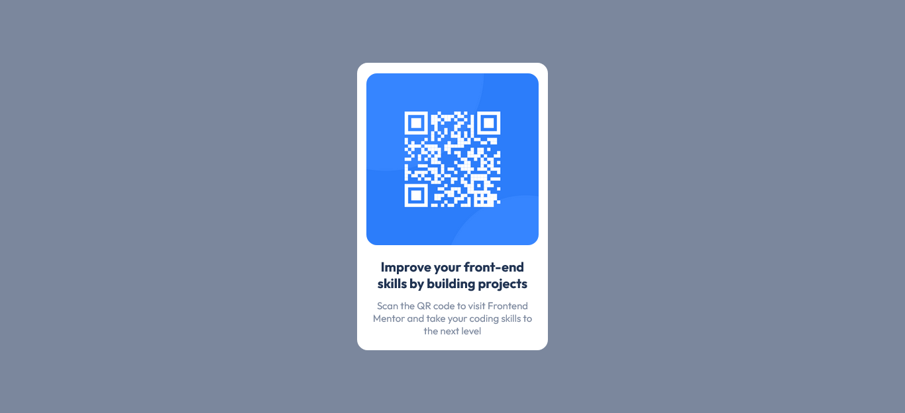

# Frontend Mentor - QR code component solution

This is a solution to the [QR code component challenge on Frontend Mentor](https://www.frontendmentor.io/challenges/qr-code-component-iux_sIO_H). Frontend Mentor challenges help you improve your coding skills by building realistic projects.

## Table of contents

- [Overview](#overview)
  - [Screenshot](#screenshot)
- [My process](#my-process)
  - [Built with](#built-with)
  - [What I learned](#what-i-learned)
  - [Continued development](#continued-development)
  - [Useful resources](#useful-resources)

## Overview

### Screenshot



## My process

### Built with

- Semantic HTML5 markup
- CSS custom properties
- Flexbox
- Parcel

### What I learned

I learned to center child elements within their parent container using flexbox. In particular, this project uses the following code to center the component horizontally and vertically within the body of the page:

```css
html,
body {
  height: 100%;
  margin: 0;
}

body {
  display: flex;
  align-items: center;
  justify-content: center;
}
```

### Continued development

I'd like to use the above code to center child elements within their parent characters in more complicated layouts.

### Useful resources

- [Centering elements with flexbox](https://softauthor.com/css-how-to-center-a-div-horizontally-vertically/) - This site provided the solution which centered the component horizontally and vertically.
